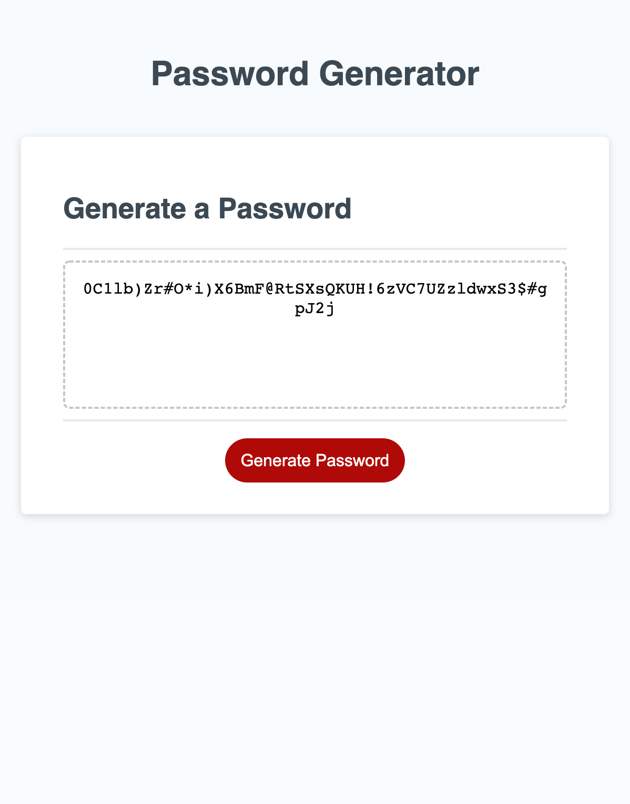

# Password Generator

## Secure Password Generator 

Deployed Link:
[https://sprantis.github.io/password-generator/]

Description:
I have refactored a password generator app to help create secure passwords. The password generator asks for user input like character limits, inclusion of uppercase or lowercase letters, numbers, and special characters. Once acceptance criteria for the password is met, a randomized password is generated and displayed on the page. 

Screenshot:

Repo Link:
[https://github.com/sprantis/password-generator]
